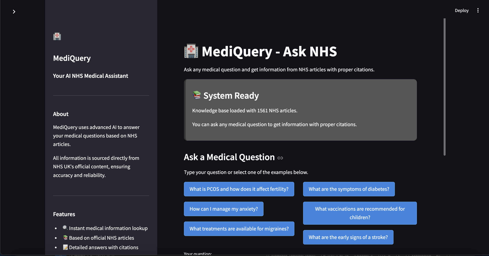
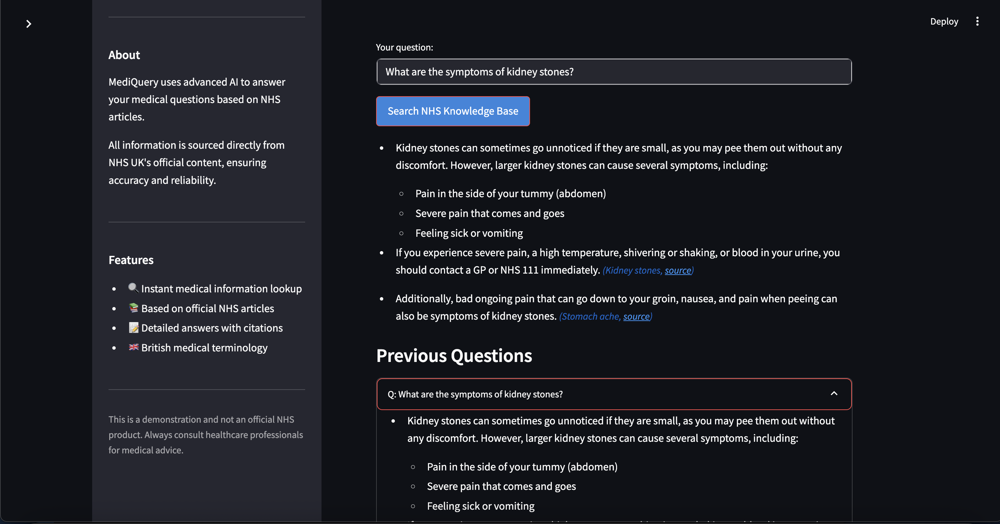

# MediQuery - NHS Medical Assistant

MediQuery is a RAG system that provides medical information based on NHS articles. It uses natural language processing to retrieve relevant information from a database of scraped NHS articles and generate accurate answers to medical queries.

## Project Structure

```
mediquery/
├── app/
│   ├── app_rag.py        # Main Streamlit application for MediQuery
│   ├── nhs_articles.csv  # Processed NHS articles data used by the app
│   └── chroma_db/        # Vector database (generated on first run)
│
└── research/
    ├── data/
    │   ├── nhs_articles_links.csv  # Links to NHS articles
    │   └── nhs_articles.csv        # Processed NHS articles data
    ├── rag.py                      # Core RAG implementation
    ├── read_nhs.py                 # Script to scrape NHS article links
    └── read_nhs_articles.py        # Script to extract article content
```

## Features

- 🔍 Instant medical information lookup
- 📚 Based on official NHS articles
- 📝 Detailed answers with citations
- 🇬🇧 British medical terminology

## Screenshots


*The MediQuery user interface showing the search functionality and NHS knowledge base.*


*Example of a medical query result with citations to NHS articles.*

## Important Libraries

- **LangChain**: Framework for developing applications powered by language models
- **OpenAI**: GPT-4 for response generation
- **Streamlit**: Web application framework for the user interface
- **Chroma**: Vector database for storing and retrieving document embeddings
- **HuggingFace Transformers**: For embedding model (sentence-transformers)
- **BeautifulSoup & Selenium**: For web scraping NHS articles
- **Pandas**: For data manipulation and management

## Requirements

- Python 3.8+
- OpenAI API key
- Chrome browser (for scraping scripts)
- Required Python packages (see `requirements.txt`)

## Installation

1. Clone the repository:
   ```
   git clone https://github.com/yourusername/mediquery.git
   cd mediquery
   ```

2. Install the required packages:
   ```
   pip install -r requirements.txt
   ```

3. Create a `.env` file in the root directory with your OpenAI API key:
   ```
   OPENAI_API_KEY=your_api_key_here
   ```

## Usage

### Running the Web Application

The Streamlit application provides a user-friendly interface for interacting with the RAG system:

```bash
cd app
streamlit run app_rag.py
```

This will start the web application on `http://localhost:8501`.

### Using the Core RAG System

You can also use the core RAG implementation directly:

```bash
cd research
python rag.py
```

This will run a test query to demonstrate the RAG system functionality.

### Data Collection (Optional)

If you want to refresh the NHS article data:

1. Scrape article links:
   ```bash
   cd research
   python read_nhs.py
   ```

2. Extract article content:
   ```bash
   cd research
   python read_nhs_articles.py
   ```

## How It Works

1. **Data Collection**: NHS articles are scraped and processed into a structured format.
2. **Vector Database**: Article content is split into chunks, embedded, and stored in a Chroma vector database.
3. **Query Processing**: When a user asks a question, the system:
   - Finds relevant NHS article chunks using semantic search
   - Generates a comprehensive answer using LLM (GPT-4)
   - Provides proper citations to NHS sources

## Acknowledgements

This project uses data from NHS UK's official content. It is designed for educational purposes only and should not replace professional medical advice.


