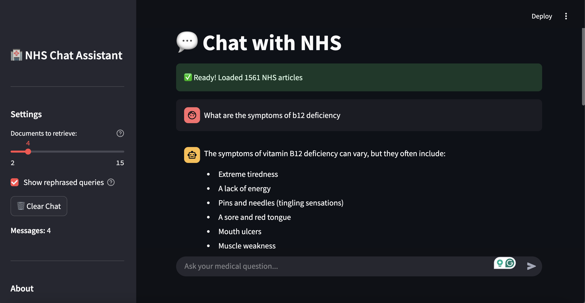
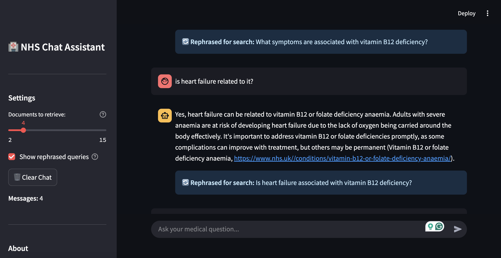

# NHS Medical Assistant

This chat system provides medical information based on NHS articles. It uses natural language processing to retrieve relevant information from a database of scraped NHS articles and generate accurate answers to medical queries. The system includes intelligent query rephrasing to understand conversational context and references like "it", "that", or "those" from previous messages.

## Project Structure

```
nhs-assistant/
├── app/
│   ├── app_rag.py        # Main Streamlit application 
│   ├── nhs_articles.csv  # Scraped NHS articles data used by the app incase no vector db is present
│   └── chroma_db/        # Vector database (generated on first run)
│
└── research/
    ├── data/
    │   ├── nhs_articles_links.csv  # Links to NHS articles
    │   └── nhs_articles.csv        # Scraped NHS articles data
    ├── rag.py                      # Core RAG implementation
    ├── read_nhs.py                 # Script to scrape NHS article links
    └── read_nhs_articles.py        # Script to extract article content
```

## Features

- 🔍 Instant medical information lookup
- 📚 Based on official NHS articles
- 📝 Detailed answers with citations
- 💬 Native Streamlit chat interface
- 🔄 Smart query rephrasing for better context understanding
- 🇬🇧 British medical terminology

## Screenshots


*The system user interface showing the chat UI*


*Example of a medical query result with citations to NHS articles.*

## NHS Categories Scraped

The system scrapes articles from the following NHS categories:
- **Conditions**: Medical conditions and diseases (e.g., diabetes, asthma)
- **Symptoms**: Common symptoms and their potential causes
- **Tests and Treatments**: Medical procedures, tests, and treatment options
- **Medicines**: Information about medications, including usage and side effects

## Important Libraries

- **LangChain**: Framework for developing applications powered by language models
- **OpenAI**: GPT-4o-mini for response generation and query rephrasing
- **Streamlit**: Web application framework with native chat interface
- **Chroma**: Vector database for storing and retrieving document embeddings
- **HuggingFace Transformers**: For embedding model (sentence-transformers)
- **BeautifulSoup & Selenium**: For web scraping NHS articles
- **Pandas**: For data manipulation and management

## Requirements

- Python 3.8+
- OpenAI API key
- Chrome browser (for scraping scripts)
- Required Python packages (see `requirements.txt`)

## Installation

1. Clone the repository:
   ```
   https://github.com/namratanwani/nhs-assistant.git
   cd nhs-assistant
   ```

2. Install the required packages:
   ```
   pip install -r requirements.txt
   ```

3. Create a `.env` file in the root directory with your OpenAI API key:
   ```
   OPENAI_API_KEY=your_api_key_here
   ```

## Usage

### Running the Web Application

The Streamlit application provides a user-friendly chat interface for interacting with the RAG system:

```bash
cd app
streamlit run app_rag.py
```

This will start the web application on `http://localhost:8501`.

### Using the Core RAG System

You can also use the core RAG implementation directly:

```bash
cd research
python rag.py
```

This will run a test query to demonstrate the RAG system functionality.

### Data Collection (Optional)

If you want to refresh the NHS article data:

1. Scrape article links:
   ```bash
   cd research
   python read_nhs.py
   ```

2. Extract article content:
   ```bash
   cd research
   python read_nhs_articles.py
   ```

## How It Works

1. **Data Collection**: NHS articles are scraped and processed into a structured format.
2. **Vector Database**: Article content is split into chunks, embedded, and stored in a Chroma vector database.
3. **Query Processing**: When a user asks a question, the system:
   - Rephrases queries with context from chat history for better retrieval
   - Finds relevant NHS article chunks using semantic search
   - Generates a comprehensive answer using LLM (GPT-4o-mini)
   - Provides proper citations to NHS sources

## Chat Features

- **Contextual Understanding**: Ask follow-up questions using "it", "that", "those" - the system maintains conversation context
- **Query Optimization**: Questions are automatically rephrased for better medical information retrieval
- **Native Chat UI**: Clean, familiar chat interface with instant message display
- **Adjustable Retrieval**: Configure number of documents retrieved (2-15) for different query complexities

## Future Work

- Implement periodic scraping of NHS website to keep information up-to-date
- Expand coverage to include additional NHS categories such as lifestyle, mental health, and preventive care
- Add multi-language support to make medical information more accessible

## Acknowledgements

This project uses public data from NHS UK's official content. It is designed for educational purposes only and should not replace professional medical advice.